# 🏗️ Offline Architecture - Pandom Stack

## Panoramica Architetturale

Il sistema Pandom Stack implementa un'architettura offline-first che garantisce resilienza, continuità operativa e sicurezza anche in assenza di connessione internet. L'architettura è progettata per supportare scenari di hackathon sulla sicurezza e resilienza.

## 🎯 Principi Architetturali

### 1. Offline-First Design
- **Priorità offline**: L'applicazione funziona offline come priorità
- **Sync quando possibile**: Sincronizzazione automatica quando online
- **Graceful degradation**: Degradazione elegante delle funzionalità

### 2. Data Resilience
- **Redundanza locale**: Dati critici sempre disponibili localmente
- **Backup automatico**: Backup periodici dei dati offline
- **Integrità dati**: Verifica e riparazione automatica

### 3. Security by Design
- **Crittografia locale**: Dati sensibili crittografati localmente
- **Audit trail**: Tracciamento completo delle attività offline
- **Access control**: Controllo accessi anche offline

## 🏗️ Architettura a Livelli

```
┌─────────────────────────────────────────────────────────────┐
│                    PRESENTATION LAYER                       │
├─────────────────────────────────────────────────────────────┤
│  ┌─────────────┐  ┌─────────────┐  ┌─────────────┐         │
│  │ Offline     │  │ Sync        │  │ Debug       │         │
│  │ Banner      │  │ Status      │  │ Panel       │         │
│  └─────────────┘  └─────────────┘  └─────────────┘         │
├─────────────────────────────────────────────────────────────┤
│                    APPLICATION LAYER                        │
├─────────────────────────────────────────────────────────────┤
│  ┌─────────────┐  ┌─────────────┐  ┌─────────────┐         │
│  │ Offline     │  │ Sync        │  │ Offline     │         │
│  │ Data        │  │ Queue       │  │ Security    │         │
│  │ Service     │  │ Service     │  │ Service     │         │
│  └─────────────┘  └─────────────┘  └─────────────┘         │
├─────────────────────────────────────────────────────────────┤
│                    STORAGE LAYER                            │
├─────────────────────────────────────────────────────────────┤
│  ┌─────────────┐  ┌─────────────┐  ┌─────────────┐         │
│  │ IndexedDB   │  │ Cache API   │  │ Local       │         │
│  │ Service     │  │ Service     │  │ Storage     │         │
│  └─────────────┘  └─────────────┘  └─────────────┘         │
├─────────────────────────────────────────────────────────────┤
│                    INFRASTRUCTURE LAYER                     │
├─────────────────────────────────────────────────────────────┤
│  ┌─────────────┐  ┌─────────────┐  ┌─────────────┐         │
│  │ Service     │  │ Network     │  │ Browser     │         │
│  │ Worker      │  │ Detection   │  │ APIs        │         │
│  └─────────────┘  └─────────────┘  └─────────────┘         │
└─────────────────────────────────────────────────────────────┘
```

## 🔧 Componenti Architetturali

### 1. Infrastructure Layer

#### Service Worker
```typescript
// Gestione cache e richieste offline
class PandomServiceWorker {
  // Cache strategy per asset statici
  cacheFirst(request: Request): Promise<Response>
  
  // Cache strategy per API calls
  networkFirst(request: Request): Promise<Response>
  
  // Fallback per richieste offline
  offlineFallback(request: Request): Response
}
```

#### Network Detection
```typescript
// Monitoraggio stato connessione
class NetworkService {
  isOnline(): boolean
  onOnline(callback: Function): void
  onOffline(callback: Function): void
  getConnectionType(): 'wifi' | '4g' | '3g' | '2g' | 'slow-2g' | 'offline'
}
```

### 2. Storage Layer

#### IndexedDB Service
```typescript
// Database locale per dati utente
interface IndexedDBSchema {
  users: {
    keyPath: 'uuid'
    indexes: ['email', 'lastSync']
  }
  pendingOperations: {
    keyPath: 'id'
    indexes: ['timestamp', 'type']
  }
  securityLogs: {
    keyPath: 'id'
    indexes: ['userId', 'timestamp', 'type']
  }
  offlineMetrics: {
    keyPath: 'id'
    indexes: ['timestamp']
  }
}
```

#### Cache API Service
```typescript
// Cache per asset e API responses
class CacheService {
  // Cache asset statici
  cacheAssets(assets: string[]): Promise<void>
  
  // Cache API responses
  cacheAPIResponse(url: string, response: Response): Promise<void>
  
  // Invalidate cache
  invalidateCache(pattern: string): Promise<void>
}
```

### 3. Application Layer

#### Offline Data Service
```typescript
// Gestione dati offline
class OfflineDataService {
  // Sincronizzazione dati utente
  syncUserData(userId: string): Promise<void>
  
  // Accesso dati offline
  getOfflineData(userId: string): Promise<OfflineUserData>
  
  // Aggiornamento dati offline
  updateOfflineData(userId: string, data: any): Promise<void>
  
  // Export dati offline
  exportOfflineData(userId: string): Promise<Blob>
}
```

#### Sync Queue Service
```typescript
// Gestione coda sincronizzazione
class SyncQueueService {
  // Aggiunta operazione alla coda
  addToQueue(operation: OfflineOperation): Promise<void>
  
  // Processamento coda
  processQueue(): Promise<void>
  
  // Retry logic
  retryOperation(operation: OfflineOperation): Promise<void>
  
  // Conflict resolution
  resolveConflict(localData: any, serverData: any): any
}
```

#### Offline Security Service
```typescript
// Sicurezza offline
class OfflineSecurityService {
  // Validazione accesso offline
  validateOfflineAccess(): Promise<boolean>
  
  // Crittografia dati locali
  encryptData(data: any): Promise<string>
  
  // Decrittografia dati locali
  decryptData(encryptedData: string): Promise<any>
  
  // Log attività offline
  logOfflineActivity(activity: string): Promise<void>
}
```

### 4. Presentation Layer

#### Offline UI Components
```typescript
// Componenti UI per modalità offline
interface OfflineUIComponents {
  OfflineBanner: Component
  SyncStatus: Component
  OfflineDataViewer: Component
  DebugPanel: Component
}
```

## 🔄 Flussi Architetturali

### 1. Flusso di Sincronizzazione

```mermaid
graph TD
    A[Utente Modifica Dati] --> B{Online?}
    B -->|Sì| C[Sync Immediato]
    B -->|No| D[Salva in Coda]
    D --> E[Cache Locale]
    E --> F[Attendi Connessione]
    F --> G[Processa Coda]
    G --> H[Sync con Server]
    H --> I[Conflitti?]
    I -->|Sì| J[Conflict Resolution]
    I -->|No| K[Sync Completato]
    J --> K
    C --> K
```



### 2. Flusso di Accesso Offline

```mermaid
graph TD
    A[Richiesta Dati] --> B{Online?}
    B -->|Sì| C[Fetch da Server]
    B -->|No| D[Cache Locale]
    D --> E{Dati Disponibili?}
    E -->|Sì| F[Restituisci Dati]
    E -->|No| G[Fallback UI]
    C --> H[Cache Dati]
    H --> F
```



### 3. Flusso di Sicurezza Offline

```mermaid
graph TD
    A[Accesso Offline] --> B[Valida Token]
    B --> C{Token Valido?}
    C -->|Sì| D[Decrittografa Dati]
    C -->|No| E[Accesso Negato]
    D --> F[Log Attività]
    F --> G[Operazione Offline]
    G --> H[Crittografa Modifiche]
    H --> I[Salva in Coda]
```



## 🗄️ Modello Dati Offline

### Schema IndexedDB

```typescript
// Database: pandom-offline
// Version: 1

interface DatabaseSchema {
  // Store: users
  users: {
    uuid: string;           // Primary key
    email: string;          // Index
    user: UserData;         // Dati utente
    profile: ProfileData;   // Dati profilo
    security_logs: LogEntry[]; // Log di sicurezza
    last_sync: string;      // Timestamp ultima sync
    created_at: string;     // Timestamp creazione
    updated_at: string;     // Timestamp aggiornamento
  }

  // Store: pendingOperations
  pendingOperations: {
    id: string;             // Primary key
    type: 'CREATE' | 'UPDATE' | 'DELETE'; // Tipo operazione
    endpoint: string;       // Endpoint API
    data: any;             // Dati operazione
    timestamp: string;      // Timestamp creazione
    retry_count: number;    // Numero tentativi
    last_retry: string;     // Timestamp ultimo tentativo
  }

  // Store: securityLogs
  securityLogs: {
    id: number;             // Auto-increment
    userId: string;         // Index
    event_type: string;     // Tipo evento
    timestamp: string;      // Timestamp evento
    details: any;           // Dettagli evento
    source: 'online' | 'offline'; // Sorgente evento
  }

  // Store: offlineMetrics
  offlineMetrics: {
    id: string;             // Primary key
    offline_time: number;   // Tempo offline (secondi)
    operations_queued: number; // Operazioni in coda
    sync_success_rate: number; // Tasso successo sync
    data_freshness: number; // Freschezza dati (secondi)
    timestamp: string;      // Timestamp metrica
  }
}
```

### Modello Operazioni Offline

```typescript
interface OfflineOperation {
  id: string;                    // ID univoco operazione
  type: 'CREATE' | 'UPDATE' | 'DELETE'; // Tipo operazione
  endpoint: string;              // Endpoint API target
  data: any;                     // Dati operazione
  timestamp: string;             // Timestamp creazione
  retry_count: number;           // Numero tentativi
  max_retries: number;           // Numero massimo tentativi
  retry_delay: number;           // Delay tra tentativi (ms)
  priority: 'high' | 'normal' | 'low'; // Priorità operazione
  dependencies?: string[];       // Operazioni dipendenti
}

interface SyncResult {
  operation_id: string;          // ID operazione
  success: boolean;              // Esito operazione
  error?: string;                // Messaggio errore
  retry_count: number;           // Numero tentativi effettuati
  timestamp: string;             // Timestamp completamento
  response_data?: any;           // Dati risposta server
}
```

## 🔐 Sicurezza Architetturale

### 1. Crittografia Dati Locali

```typescript
class OfflineEncryption {
  // Algoritmo: AES-GCM
  // Key derivation: PBKDF2
  // Salt: fisso per l'applicazione
  // Iterazioni: 100,000

  async encryptData(data: any, password: string): Promise<string> {
    const key = await this.deriveKey(password);
    const iv = crypto.getRandomValues(new Uint8Array(12));
    
    const encodedData = new TextEncoder().encode(JSON.stringify(data));
    const encryptedData = await crypto.subtle.encrypt(
      { name: 'AES-GCM', iv },
      key,
      encodedData
    );

    return this.combineIVAndData(iv, new Uint8Array(encryptedData));
  }

  async decryptData(encryptedData: string, password: string): Promise<any> {
    const key = await this.deriveKey(password);
    const { iv, data } = this.separateIVAndData(encryptedData);
    
    const decryptedData = await crypto.subtle.decrypt(
      { name: 'AES-GCM', iv },
      key,
      data
    );

    return JSON.parse(new TextDecoder().decode(decryptedData));
  }
}
```

### 2. Validazione Accesso Offline

```typescript
class OfflineAccessControl {
  async validateOfflineAccess(token: string): Promise<boolean> {
    try {
      const decoded = jwt_decode(token);
      const now = Date.now() / 1000;
      
      // Token valido per almeno 1 ora
      if (decoded.exp < now + 3600) {
        return false;
      }
      
      // Verifica ruoli e permessi
      return this.validatePermissions(decoded);
    } catch {
      return false;
    }
  }

  private validatePermissions(decoded: any): boolean {
    // Implementa logica di validazione permessi
    return decoded.role === 'user' || decoded.role === 'admin';
  }
}
```

### 3. Audit Trail Offline

```typescript
class OfflineAuditTrail {
  async logActivity(activity: AuditActivity): Promise<void> {
    const logEntry = {
      id: this.generateId(),
      userId: activity.userId,
      event_type: activity.eventType,
      timestamp: new Date().toISOString(),
      details: activity.details,
      source: 'offline',
      session_id: activity.sessionId,
      ip_address: 'offline',
      user_agent: navigator.userAgent
    };

    await this.offlineStorage.addSecurityLog(logEntry);
  }

  async getAuditLogs(userId: string): Promise<AuditLogEntry[]> {
    return await this.offlineStorage.getSecurityLogs(userId);
  }
}
```

## 📊 Monitoraggio e Metriche

### 1. Metriche Offline

```typescript
interface OfflineMetrics {
  // Performance
  offline_time: number;           // Tempo totale offline (secondi)
  sync_duration: number;          // Durata sincronizzazione (ms)
  cache_hit_rate: number;         // Tasso hit cache (%)
  
  // Operations
  operations_queued: number;      // Operazioni in coda
  operations_synced: number;      // Operazioni sincronizzate
  operations_failed: number;      // Operazioni fallite
  sync_success_rate: number;      // Tasso successo sync (%)
  
  // Data
  data_freshness: number;         // Freschezza dati (secondi)
  data_size: number;              // Dimensione dati locali (bytes)
  storage_usage: number;          // Utilizzo storage (%)
  
  // Security
  security_events: number;        // Eventi di sicurezza
  access_attempts: number;        // Tentativi di accesso
  failed_access: number;          // Accessi falliti
}
```

### 2. Health Check Offline

```typescript
class OfflineHealthCheck {
  async checkHealth(): Promise<HealthStatus> {
    const status: HealthStatus = {
      database: await this.checkDatabaseHealth(),
      storage: await this.checkStorageHealth(),
      sync: await this.checkSyncHealth(),
      security: await this.checkSecurityHealth(),
      timestamp: new Date().toISOString()
    };

    return status;
  }

  private async checkDatabaseHealth(): Promise<'healthy' | 'degraded' | 'down'> {
    try {
      await this.offlineStorage.initializeDB();
      return 'healthy';
    } catch (error) {
      console.error('Database health check failed:', error);
      return 'down';
    }
  }

  private async checkStorageHealth(): Promise<'healthy' | 'degraded' | 'down'> {
    try {
      const quota = await navigator.storage.estimate();
      const usagePercent = (quota.usage || 0) / (quota.quota || 1) * 100;
      
      if (usagePercent < 80) return 'healthy';
      if (usagePercent < 95) return 'degraded';
      return 'down';
    } catch {
      return 'degraded';
    }
  }
}
```

## 🔄 Strategie di Sincronizzazione

### 1. Sync Strategies

```typescript
enum SyncStrategy {
  IMMEDIATE = 'immediate',    // Sync immediato quando online
  BATCHED = 'batched',        // Sync in batch
  SCHEDULED = 'scheduled',    // Sync programmato
  MANUAL = 'manual'           // Sync manuale
}

class SyncManager {
  async syncWithStrategy(strategy: SyncStrategy): Promise<void> {
    switch (strategy) {
      case SyncStrategy.IMMEDIATE:
        await this.immediateSync();
        break;
      case SyncStrategy.BATCHED:
        await this.batchedSync();
        break;
      case SyncStrategy.SCHEDULED:
        await this.scheduledSync();
        break;
      case SyncStrategy.MANUAL:
        await this.manualSync();
        break;
    }
  }

  private async immediateSync(): Promise<void> {
    // Sync immediato per operazioni critiche
    const criticalOperations = this.getCriticalOperations();
    for (const operation of criticalOperations) {
      await this.processOperation(operation);
    }
  }

  private async batchedSync(): Promise<void> {
    // Sync in batch per performance
    const operations = this.getAllOperations();
    const batches = this.createBatches(operations, 10);
    
    for (const batch of batches) {
      await Promise.all(batch.map(op => this.processOperation(op)));
    }
  }
}
```

### 2. Conflict Resolution

```typescript
class ConflictResolver {
  async resolveConflict(localData: any, serverData: any): Promise<any> {
    const strategy = this.determineStrategy(localData, serverData);
    
    switch (strategy) {
      case 'last-write-wins':
        return this.lastWriteWins(localData, serverData);
      case 'merge':
        return this.mergeData(localData, serverData);
      case 'manual':
        return this.manualResolution(localData, serverData);
      default:
        return serverData;
    }
  }

  private determineStrategy(localData: any, serverData: any): string {
    // Logica per determinare strategia di risoluzione
    if (this.isProfileData(localData)) return 'merge';
    if (this.isCriticalData(localData)) return 'manual';
    return 'last-write-wins';
  }

  private mergeData(localData: any, serverData: any): any {
    // Merge intelligente dei dati
    return {
      ...serverData,
      ...localData,
      last_modified: new Date().toISOString(),
      merge_source: 'offline'
    };
  }
}
```

## 🚀 Deployment e Configurazione

### 1. Configurazione Environment

```typescript
// environment.ts
export const environment = {
  production: false,
  apiUrl: 'http://localhost:3000/api',
  offline: {
    enabled: true,
    maxCacheSize: 100 * 1024 * 1024, // 100MB
    syncInterval: 5 * 60 * 1000,     // 5 minuti
    retryAttempts: 3,
    retryDelay: 1000,                // 1 secondo
    encryption: {
      enabled: true,
      algorithm: 'AES-GCM',
      keyLength: 256,
      iterations: 100000
    },
    storage: {
      dbName: 'pandom-offline',
      version: 1,
      maxSize: 50 * 1024 * 1024      // 50MB
    }
  }
};
```

### 2. Service Worker Configuration

```json
// ngsw-config.json
{
  "assetGroups": [
    {
      "name": "app",
      "installMode": "prefetch",
      "resources": {
        "files": [
          "/favicon.ico",
          "/index.html",
          "/*.css",
          "/*.js"
        ]
      }
    }
  ],
  "dataGroups": [
    {
      "name": "api-offline",
      "urls": ["/api/auth/**", "/api/profile/**"],
      "cacheConfig": {
        "strategy": "performance",
        "maxSize": 50,
        "maxAge": "7d"
      }
    },
    {
      "name": "api-freshness",
      "urls": ["/api/**"],
      "cacheConfig": {
        "strategy": "freshness",
        "maxSize": 100,
        "maxAge": "3d",
        "timeout": "10s"
      }
    }
  ]
}
```

## 🧪 Testing Architetturale

### 1. Test di Resilienza

```typescript
class OfflineResilienceTest {
  async testOfflineResilience(): Promise<TestResult> {
    const results: TestResult = {
      database: await this.testDatabaseResilience(),
      sync: await this.testSyncResilience(),
      security: await this.testSecurityResilience(),
      performance: await this.testPerformanceResilience()
    };

    return results;
  }

  private async testDatabaseResilience(): Promise<TestResult> {
    // Test: Database funziona offline
    // Test: Migrazione schema
    // Test: Corruzione dati
    // Test: Recovery automatico
  }

  private async testSyncResilience(): Promise<TestResult> {
    // Test: Sync con connessione instabile
    // Test: Sync con server down
    // Test: Conflict resolution
    // Test: Retry logic
  }
}
```

### 2. Test di Sicurezza

```typescript
class OfflineSecurityTest {
  async testOfflineSecurity(): Promise<SecurityTestResult> {
    const results: SecurityTestResult = {
      encryption: await this.testEncryption(),
      access_control: await this.testAccessControl(),
      audit_trail: await this.testAuditTrail(),
      data_integrity: await this.testDataIntegrity()
    };

    return results;
  }

  private async testEncryption(): Promise<TestResult> {
    // Test: Crittografia dati sensibili
    // Test: Key derivation
    // Test: Decrittografia
    // Test: Key rotation
  }
}
```

Questa documentazione architetturale fornisce una visione completa del sistema offline del Pandom Stack, evidenziando i principi di design, i componenti chiave e le strategie implementate per garantire resilienza e sicurezza in scenari offline. 